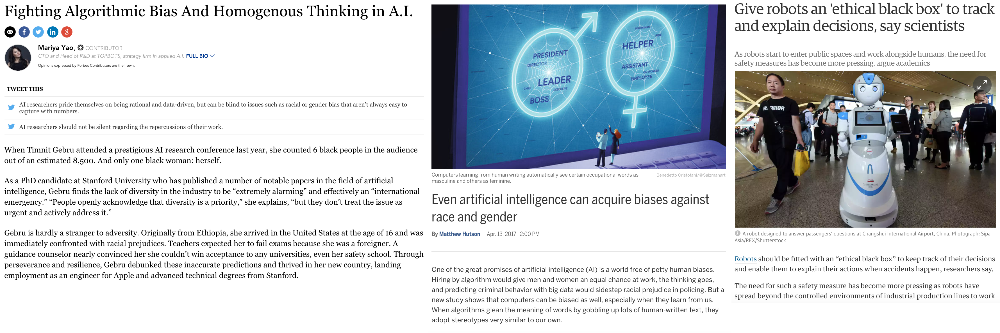
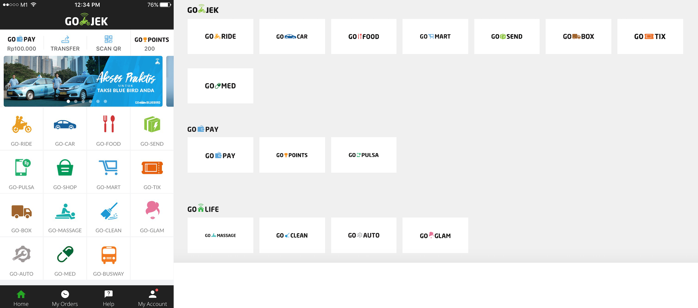
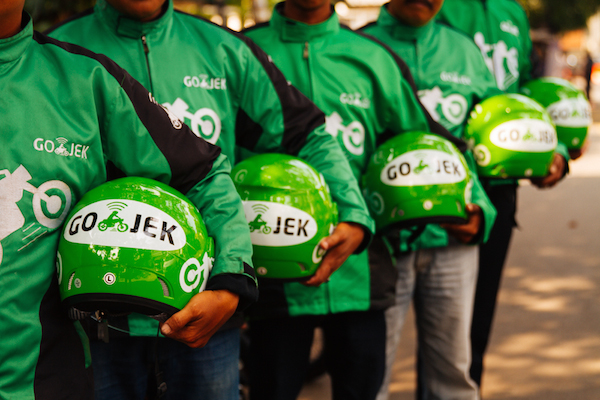
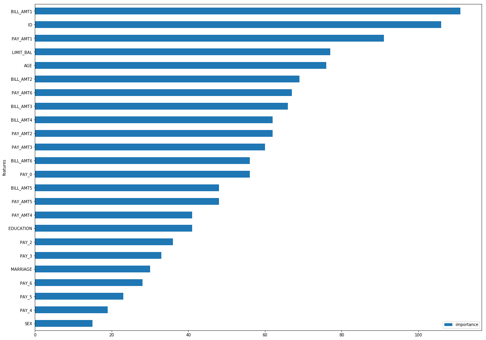
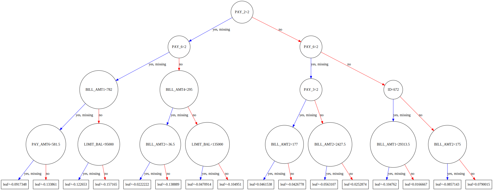
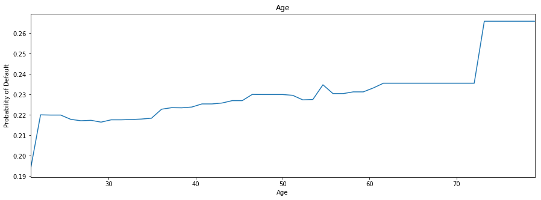
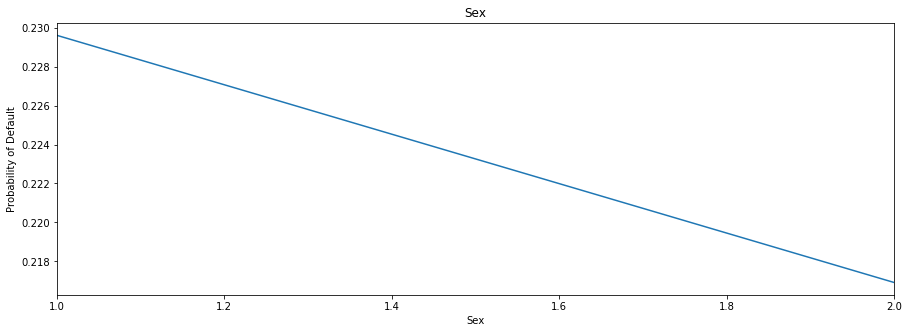
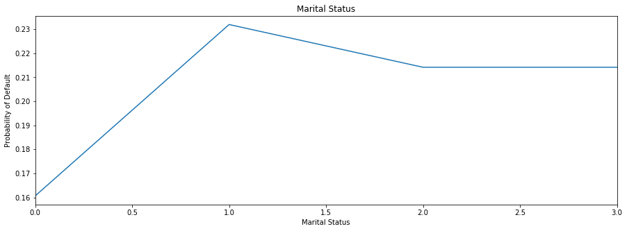
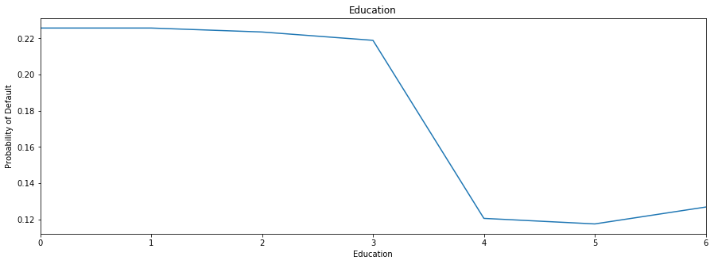

I was honoured to be invited to present on Model Bias at Singapore City-AI's 3rd Quarterly Meetup.

I presented a case study from Gojek- our drivers ranking model and various ways we can use to dissect the model in order to understand the relationship between features and prediction. I also highlighted the importance of evaluating the fairness of the model and how it impacts the overall system. Later, I used a case study from a credit default prediction challenge to demonstrate how we can use Partial Dependence Plot (PDP) to figure out how each feature affects the prediction. It was a great experience and I enjoyed interacting with other esteemed guest speakers from Nvidia, MSD, Allianz and the audience. It ended with a great panel discussion on bias in AI / ML models and how we can tackle that.

```python
import xgboost as xgb
import pandas as pd
import numpy as np
import matplotlib.pyplot as plt
%matplotlib inline
import xgbfir
pd.options.display.max_columns = 100
pd.options.display.max_rows = 100
from plotly.offline import download_plotlyjs, init_notebook_mode, plot, iplot
import plotly.graph_objs as go
init_notebook_mode(connected=True)
pd.set_option('max_colwidth',200)
import cPickle
import lime
from sklearn.model_selection import train_test_split
```


<script>requirejs.config({paths: { 'plotly': ['https://cdn.plot.ly/plotly-latest.min']},});if(!window.Plotly) {{require(['plotly'],function(plotly) {window.Plotly=plotly;});}}</script>


# Peeking Inside the Blackbox
Discover potential bias inside machine learning models

Zane Lim

* Senior data-scientist at Go-jek
* Lead and mentor a sub-team of data-scientists
* Mentor in Udacity's AI nanodegree
* Avid participant in Kaggle / data science hackathons

* https://www.linkedin.com/in/limzane/
* https://www.kaggle.com/zanelim

## AI and Machine Learning: Applications and Pitfalls
Applications
* [AlphaGo beats Ke Jie](https://www.theverge.com/2017/5/25/15689462/alphago-ke-jie-game-2-result-google-deepmind-china)
* [DeepMind training AI to beat human Starcraft players](https://www.newscientist.com/article/2143144-deepmind-dojo-will-train-ai-to-beat-human-starcraft-players/)
* [OpenAI Dota Bot destroys world's best player](https://www.theverge.com/2017/8/11/16137388/dota-2-dendi-open-ai-elon-musk)
* https://www.nytimes.com/2017/05/01/us/politics/sent-to-prison-by-a-software-programs-secret-algorithms.html
* https://www.theguardian.com/technology/self-driving-cars

Pitfalls
* http://www.sciencemag.org/news/2017/04/even-artificial-intelligence-can-acquire-biases-against-race-and-gender
* https://www.forbes.com/sites/mariyayao/2017/05/01/dangers-algorithmic-bias-homogenous-thinking-ai/#2228a48270b3
* https://techcrunch.com/2016/12/10/5-unexpected-sources-of-bias-in-artificial-intelligence/


Critical as more and more decisions are made using algorithms

## Case study on Go-Jek

 
* On-demand mobile platform that provides a variety of complete services
    * transportation (300,000 *ojek* and car driver partners)
    * logistics / food delivery (100,000 food vendors)
    * payment
    * other on-demand services (masseurs, cleaners etc.)
* As of July 2017, downloaded more than 44 million times
* Operates in 35 cities in Indonesia- Jakarta, Bandung, Surabaya, Bali, Medan, Yogyakarta etc.

### Drivers Ranking Model

* Real-time machine learning model that handles **hundreds** of driver assignment (per second) during peak hours
* Rank drivers who are available in the vicinity of customer whenever a booking is requested
* Based on certain criteria eg. *probability of completion*
* Assign the job to the top ranked driver

### Features of Model
* basic features- transactional data (time of day, location, gps accuracy)
* derived features- drivers' attributes (statistics, performance)
* re-trained everyday on a rolling window of historical data to ensure freshness
* deployed and a/b tested

### Results

* Very successful, conversion rate gain of **3%**, acceptance rate gain of **10%** on average against control
* *How do we assess biasness and fairness of the model?*
* Walking on fine line, affects the livelihood of drivers, any perceived mistreatment will trigger riots

**Dissect the model and identify potential bias**
* Plot and visualize the "model" directly (individual trees in gradient boosting model)
* Relationship between feature and prediction
    * Partial Dependence Plot (PDP) / Individual Conditional Expectation (ICE) Plot
* "Explains" the prediction
    * Local Interpretable Model-agnostic Explanations (LIME)

**Evaluate the impact of the model**
* Fairness of the system- Gini coefficient of drivers income / jobs assigned
* Average score (probability) / rank for each driver

**Promote transparency**
* Monitor and measure driver complaints on not getting jobs
* Explain and provide suggestions to drivers on how they can improve their prospect of getting jobs (indirectly promote good behaviours)

## Case study on Credit Card Default Payment

* A dataset containing, default payments, history of payments, bill statements and demographics of 30,000 credit card clients in Taiwan from April 2005 to September 2005
* Predict the probability of default payment in next month

https://www.kaggle.com/uciml/default-of-credit-card-clients-dataset

Lichman, M. (2013). UCI Machine Learning Repository [http://archive.ics.uci.edu/ml]. Irvine, CA: University of California, School of Information and Computer Science.


```python
df = pd.read_csv("../data/UCI_Credit_Card.csv")
X = df.drop('default.payment.next.month', axis=1)
y = df['default.payment.next.month']
X_train, X_test, y_train, y_test = train_test_split(X, y, test_size=0.2, random_state=0)
```


```python
with open("../data/xgb_clf.pkl") as f:
    xgb_clf = cPickle.load(f)
```

* ID: ID of each client
* LIMIT_BAL: Amount of given credit in NT dollars (includes individual and family/supplementary credit
* SEX: Gender (1=male, 2=female)
* EDUCATION: (1=graduate school, 2=university, 3=high school, 4=others, 5=unknown, 6=unknown)
* MARRIAGE: Marital status (1=married, 2=single, 3=others)
* AGE: Age in years
* PAY_0: Repayment status in September, 2005 (-1=pay duly, 1=payment delay for one month, 2=payment delay for two months, ... 8=payment delay for eight months, 9=payment delay for nine months and above)
* PAY_2: Repayment status in August, 2005 (scale same as above)
* PAY_3: Repayment status in July, 2005 (scale same as above)
* PAY_4: Repayment status in June, 2005 (scale same as above)
* PAY_5: Repayment status in May, 2005 (scale same as above)
* PAY_6: Repayment status in April, 2005 (scale same as above)
* BILL_AMT1: Amount of bill statement in September, 2005 (NT dollar)
* BILL_AMT2: Amount of bill statement in August, 2005 (NT dollar)
* BILL_AMT3: Amount of bill statement in July, 2005 (NT dollar)
* BILL_AMT4: Amount of bill statement in June, 2005 (NT dollar)
* BILL_AMT5: Amount of bill statement in May, 2005 (NT dollar)
* BILL_AMT6: Amount of bill statement in April, 2005 (NT dollar)
* PAY_AMT1: Amount of previous payment in September, 2005 (NT dollar)
* PAY_AMT2: Amount of previous payment in August, 2005 (NT dollar)
* PAY_AMT3: Amount of previous payment in July, 2005 (NT dollar)
* PAY_AMT4: Amount of previous payment in June, 2005 (NT dollar)
* PAY_AMT5: Amount of previous payment in May, 2005 (NT dollar)
* PAY_AMT6: Amount of previous payment in April, 2005 (NT dollar)
* default.payment.next.month: Default payment (1=yes, 0=no)

### Plotting the "model" directly


```python
features_importance = pd.DataFrame.from_dict(xgb_clf.get_fscore(), orient='index').reset_index().rename(columns={'index': 'features', 0: 'importance'})
features_importance.sort_values('importance', ascending=False, inplace=True)
```


```python
features_importance.plot.barh(x='features', y='importance', figsize=(20,15))
plt.gca().invert_yaxis()
```





```python
# plotting the trees directly
xgb.to_graphviz(xgb_clf, num_trees=0, size='150,200') 
```





### Partial Dependence Plot (PDP)

* A graph plotting the relationship of one single feature with the prediction / probability on average
* For each combination of a unique value of the feature with all other features, what is the average prediction / probability
* One caveat of using average is that it does not represent the usual case, as in any single realistic case, it depends on the combination with other features


```python
def plotly_lines(df, x, y):
    data = [
    go.Scatter(
        x=df[x], # assign x as the dataframe column 'x'
        y=df[y],
        name=x
    )
    ]
    return data

def plotly_figure(df, title, x_title, y_title, x, y):
    layout = go.Layout(
        title=title,
        xaxis=dict(
            title=x_title,
            titlefont=dict(
                family='Courier New, monospace',
                size=18,
                color='#7f7f7f'
            )
        ),
        yaxis=dict(
            title=y_title,
            titlefont=dict(
                family='Courier New, monospace',
                size=18,
                color='#7f7f7f'
            )
        )
    )
    return go.Figure(data=plotly_lines(df, x, y), layout=layout)
```


```python
df_plot = pd.read_csv("../data/age.csv")
ax = df_plot.plot(x='AGE', y='yhat', title='Age', figsize=(15,5), legend=False)
ax.set_xlabel("Age")
ax.set_ylabel("Probability of Default")
```


    <matplotlib.text.Text at 0x11d3003d0>





```python
df_plot = pd.read_csv("../data/sex.csv")
ax = df_plot.plot(x='SEX', y='yhat', title='Sex', figsize=(15,5), legend=False)
ax.set_xlabel("Sex")
ax.set_ylabel("Probability of Default")
```


    <matplotlib.text.Text at 0x11d5f0290>





```python
df_plot = pd.read_csv("../data/marriage.csv")
ax = df_plot.plot(x='MARRIAGE', y='yhat', title='Marital Status', figsize=(15,5), legend=False)
ax.set_xlabel("Marital Status")
ax.set_ylabel("Probability of Default")
```


    <matplotlib.text.Text at 0x11d7bba50>





```python
df.MARRIAGE.value_counts(normalize=True, sort=False)
```


    0    0.001800
    1    0.455300
    2    0.532133
    3    0.010767
    Name: MARRIAGE, dtype: float64


```python
df_plot = pd.read_csv("../data/education.csv")
ax = df_plot.plot(x='EDUCATION', y='yhat', title='Education', figsize=(15,5), legend=False)
ax.set_xlabel("Education")
ax.set_ylabel("Probability of Default")
```


    <matplotlib.text.Text at 0x11d9a9a50>





```python
df.EDUCATION.value_counts(normalize=True, sort=False)
```


    0    0.000467
    1    0.352833
    2    0.467667
    3    0.163900
    4    0.004100
    5    0.009333
    6    0.001700
    Name: EDUCATION, dtype: float64


Other techniques to dissect the black box
* Individual Conditional Expectation (ICE) Plot
* Local Interpretable Model-agnostic Explanations (LIME)

Reference:
* [Why Should I Trust You?” Explaining the Predictions of Any Classifier](https://arxiv.org/pdf/1602.04938.pdf)
* [Peeking Inside the Black Box: Visualizing Statistical Learning with Plots of Individual Conditional Expectation](https://arxiv.org/pdf/1309.6392.pdf)
* https://www.datarobot.com/blog/give-me-one-good-reason-to-trust-artificial-intelligence/

"""
    
    Build AI with conscience, trust and empathy

"""

Thank you!
